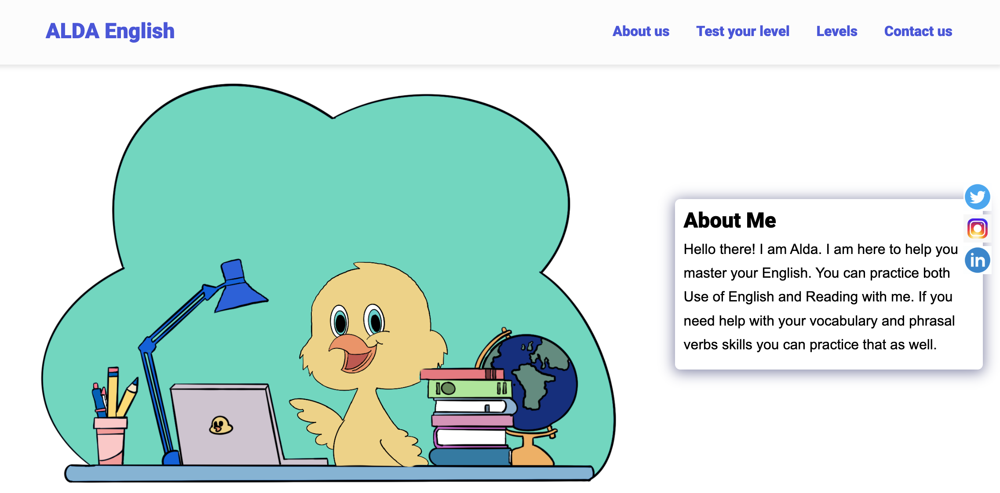

# ALDA English

The objective is to create a website to help foreign english speakers to improve their English. Although it is not finished yet, here is a photo of it.

## Author

[@danielspnz](https://twitter.com/danielpsnz)

## Github repo

This is the [link](https://github.com/danielpsnz/aldaenglish) to the Github repo of the project

## Sample Website

A live demo is already available via this [link](https://danielpsnz.github.io/aldaenglish/)

## Folder Structure

The index.html and readme files are in the root folder. In the assets folder, you can see the CSS, JavaScript files, and two folders with the images and icons used, included the screenshot of the readme file. 
